# Markdown Demo & Reference Guide

This page demonstrates all Markdown syntax features available in this Jekyll blog, including basic formatting, images, and Mermaid diagrams.

---

## Basic Markdown Syntax

### Headings

All six heading levels are available:

# H1 - Main Heading (Level 1)
## H2 - Section Heading (Level 2)
### H3 - Subsection Heading (Level 3)
#### H4 - Minor Heading (Level 4)
##### H5 - Small Heading (Level 5)
###### H6 - Smallest Heading (Level 6)

**Markdown Syntax:**
```markdown
# H1 - Main Heading
## H2 - Section Heading
### H3 - Subsection Heading
#### H4 - Minor Heading
##### H5 - Small Heading
###### H6 - Smallest Heading
```

---

### Text Formatting

**Bold text** using double asterisks or double underscores.

*Italic text* using single asterisks or single underscores.

***Bold and italic*** using triple asterisks.

~~Strikethrough~~ using double tildes.

**Markdown Syntax:**
```markdown
**Bold text** or __Bold text__
*Italic text* or _Italic text_
***Bold and italic***
~~Strikethrough~~
```

---

### Lists

#### Unordered Lists

- First item
- Second item
- Third item
  - Nested item 1
  - Nested item 2
- Fourth item

**Markdown Syntax:**
```markdown
- First item
- Second item
- Third item
  - Nested item 1
  - Nested item 2
- Fourth item
```

#### Ordered Lists

1. First item
2. Second item
3. Third item
   1. Nested numbered item
   2. Another nested item
4. Fourth item

**Markdown Syntax:**
```markdown
1. First item
2. Second item
3. Third item
   1. Nested numbered item
   2. Another nested item
4. Fourth item
```

#### Task Lists

- [x] Completed task
- [x] Another completed task
- [ ] Incomplete task
- [ ] Another incomplete task

**Markdown Syntax:**
```markdown
- [x] Completed task
- [ ] Incomplete task
```

---

### Links

[Inline link](https://www.example.com)

[Link with title](https://www.example.com "Example Website")

[Reference-style link][reference-link]

[reference-link]: https://www.example.com

**Markdown Syntax:**
```markdown
[Inline link](https://www.example.com)
[Link with title](https://www.example.com "Example Website")
[Reference-style link][reference-link]

[reference-link]: https://www.example.com
```

---

### Code

#### Inline Code

Use `inline code` with backticks for code snippets within text.

**Markdown Syntax:**
```markdown
Use `inline code` with backticks
```

#### Code Blocks

```python
def hello_world():
    print("Hello, World!")
    return True

result = hello_world()
```

```javascript
function greet(name) {
    return `Hello, ${name}!`;
}

console.log(greet("World"));
```

**Markdown Syntax:**
````markdown
```python
def hello_world():
    print("Hello, World!")
```
````

---

### Blockquotes

> This is a blockquote.
> It can span multiple lines.
>
> And include multiple paragraphs.

> **Nested blockquote:**
> > This is a nested quote inside another quote.

**Markdown Syntax:**
```markdown
> This is a blockquote.
> It can span multiple lines.
>
> And include multiple paragraphs.
```

---

### Horizontal Rules

---

**Markdown Syntax:**
```markdown
---
```

---

### Tables

| Column 1 | Column 2 | Column 3 |
|----------|----------|----------|
| Row 1    | Data     | Info     |
| Row 2    | More     | Details  |
| Row 3    | Even     | More     |

**Alignment:**

| Left Aligned | Center Aligned | Right Aligned |
|:-------------|:--------------:|--------------:|
| Left         | Center         | Right         |
| Text         | Text            | Text          |

**Markdown Syntax:**
```markdown
| Column 1 | Column 2 | Column 3 |
|----------|----------|----------|
| Row 1    | Data     | Info     |

| Left | Center | Right |
|:-----|:------:|------:|
| Left | Center | Right |
```

---

### Escaping Characters

Use backslash to escape special characters: \*asterisk\*, \`backtick\`, \#hash

**Markdown Syntax:**
```markdown
\*asterisk\*, \`backtick\`, \#hash
```

---

## Images

### Basic Image Syntax


**Markdown Syntax:**
```markdown

```

### Images from _pic/ Directory

Images stored in the `_pic/` directory can be referenced using `/pic/` path (note: no underscore in the path).

**Example:**
```markdown

```

**With title/tooltip:**
```markdown

```

### HTML Image Tag (More Control)

For more control over image size and styling:


**HTML Syntax:**
```html

```

### Responsive Image

```html

```

### Image with Caption

<figure>
  
  <figcaption>Figure 1: Example image with caption</figcaption>
</figure>

**HTML Syntax:**
```html
<figure>
  
  <figcaption>Figure 1: Example image with caption</figcaption>
</figure>
```

### Centered Image

<div style="text-align: center;">
  
</div>

**HTML Syntax:**
```html
<div style="text-align: center;">
  
</div>
```

---

## Mermaid Diagrams

Mermaid diagrams are created using code blocks with `mermaid` as the language.

### Flowchart

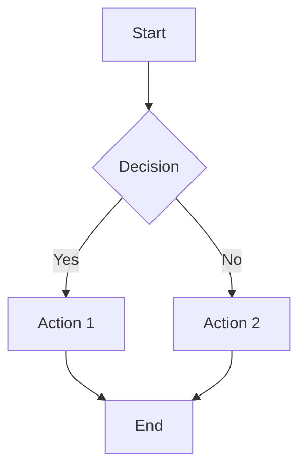

**Markdown Syntax:**
````markdown
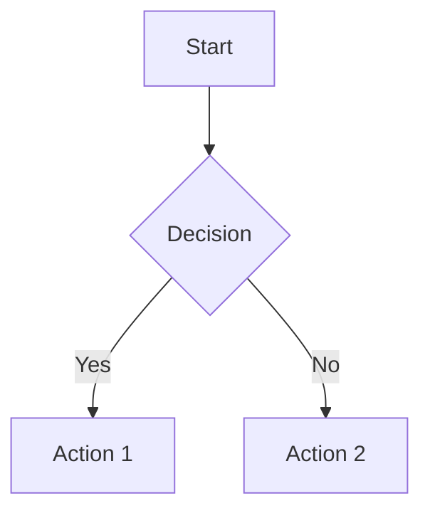
````

### Sequence Diagram

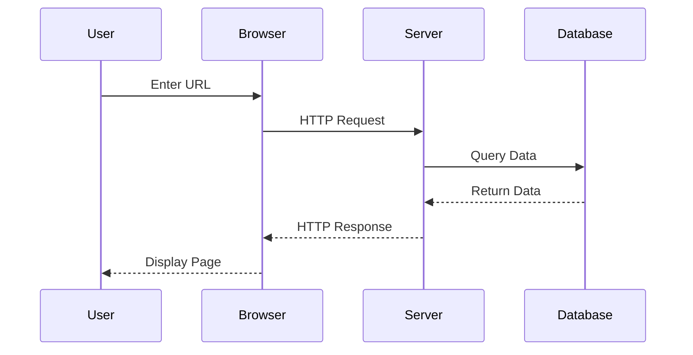

**Markdown Syntax:**
````markdown
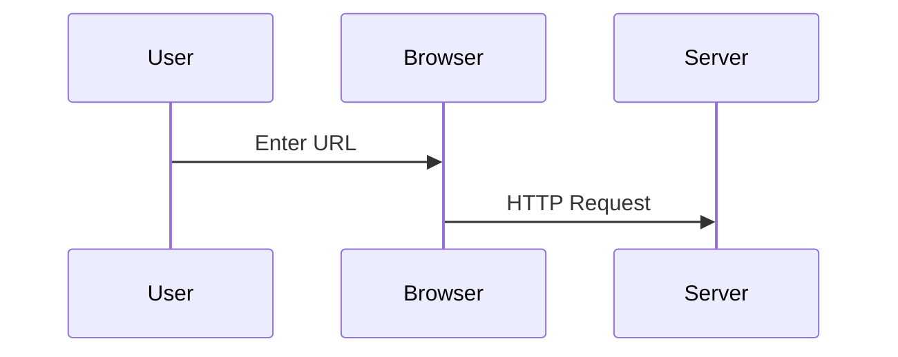
````

### Class Diagram

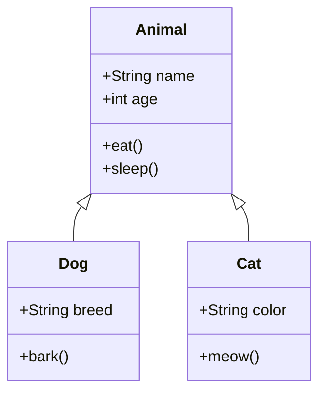

**Markdown Syntax:**
````markdown
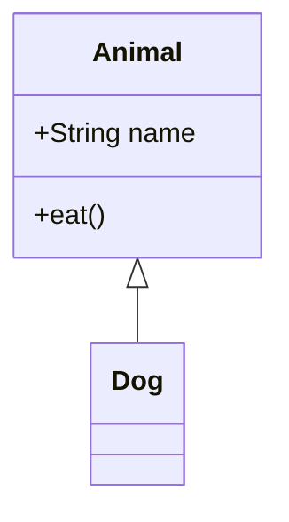
````

### State Diagram

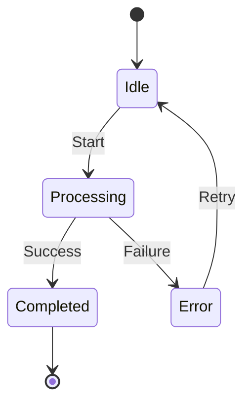

**Markdown Syntax:**
````markdown
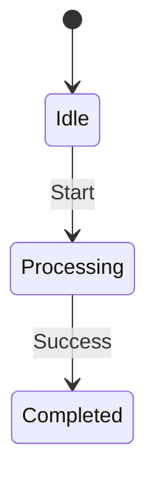
````

### Gantt Chart

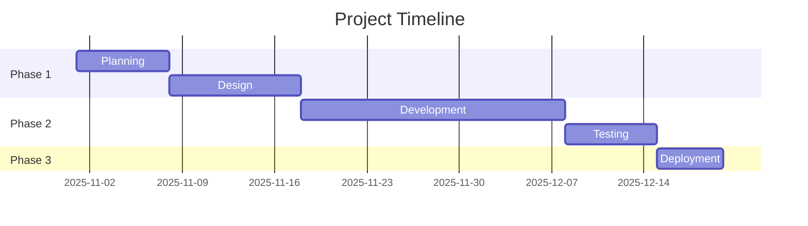

**Markdown Syntax:**
````markdown
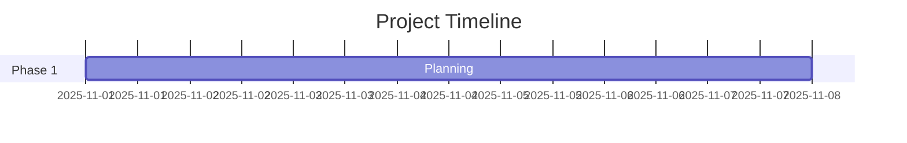
````

### Pie Chart

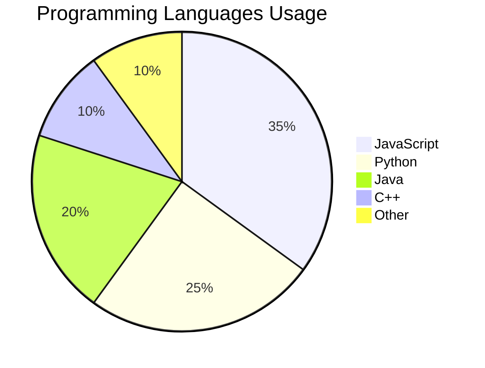

**Markdown Syntax:**
````markdown
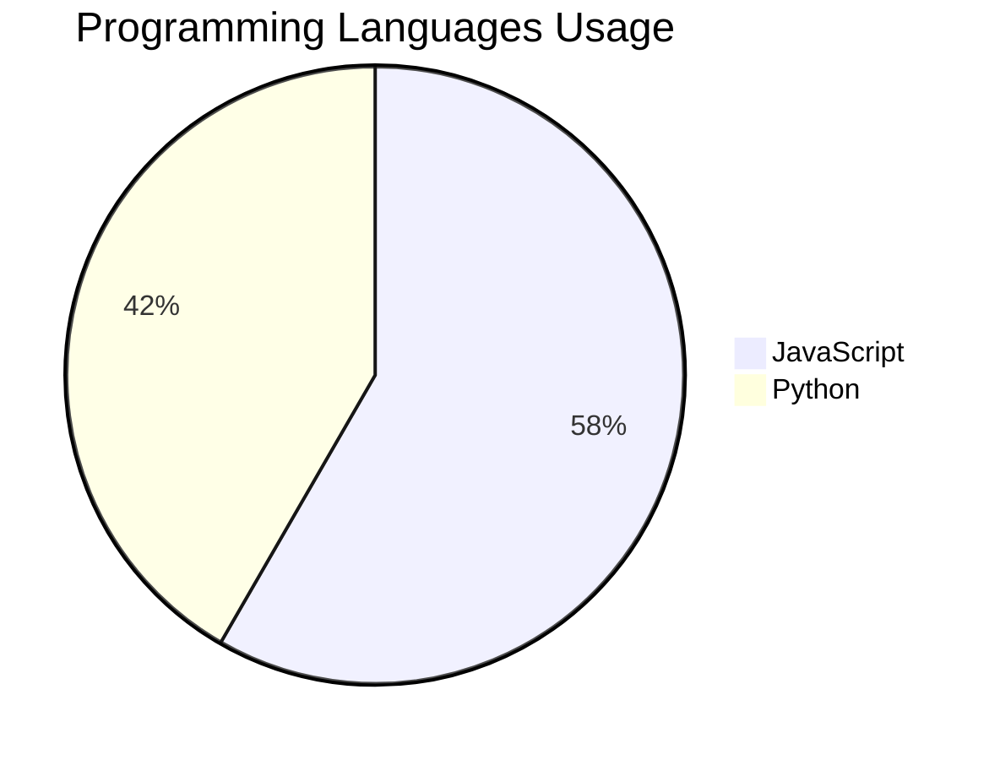
````

### Git Graph

```mermaid
gitgraph
    commit id: "Initial"
    branch develop
    checkout develop
    commit id: "Feature A"
    commit id: "Feature B"
    checkout main
    commit id: "Release"
    merge develop
    commit id: "Hotfix"
```

**Markdown Syntax:**
````markdown
```mermaid
gitgraph
    commit id: "Initial"
    branch develop
    checkout develop
    commit id: "Feature A"
```
````

### Entity Relationship Diagram

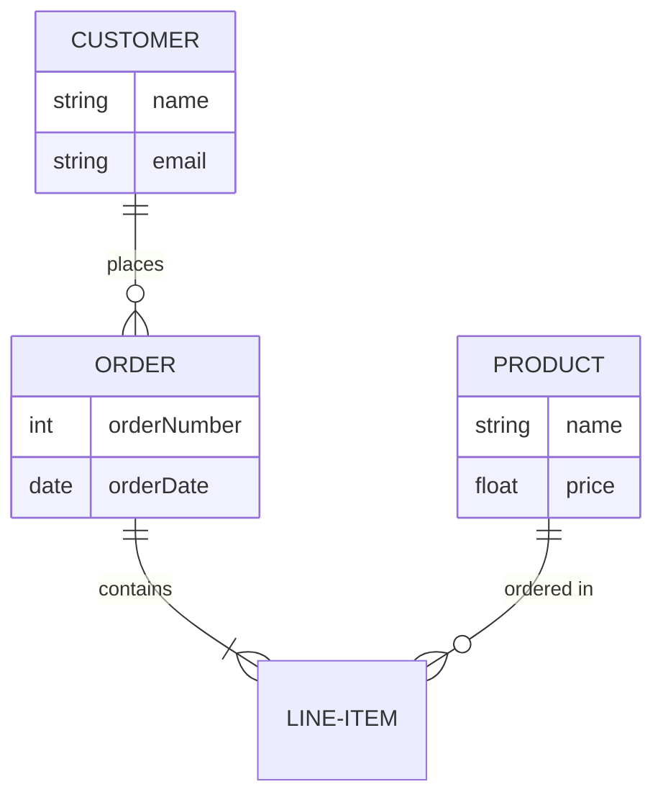

**Markdown Syntax:**
````markdown
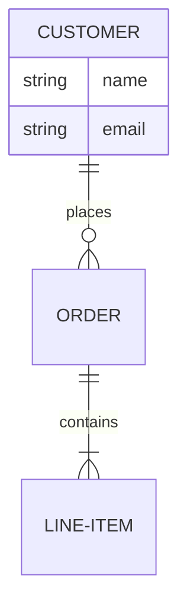
````

### Journey Diagram

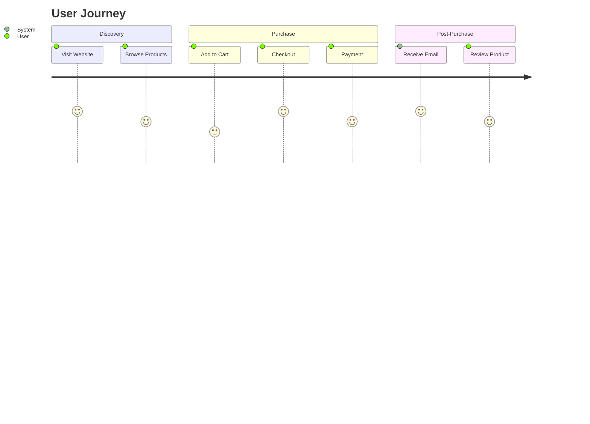

**Markdown Syntax:**
````markdown
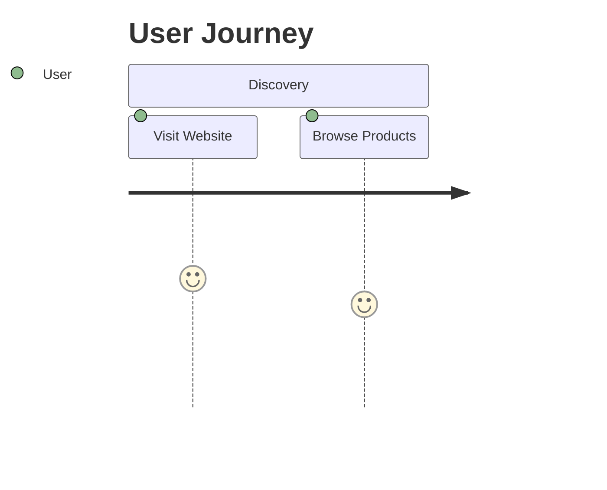
````

---

## Combining Elements

### Code Block with Mermaid

You can combine code explanations with Mermaid diagrams:

Here's a flowchart showing a simple decision process:

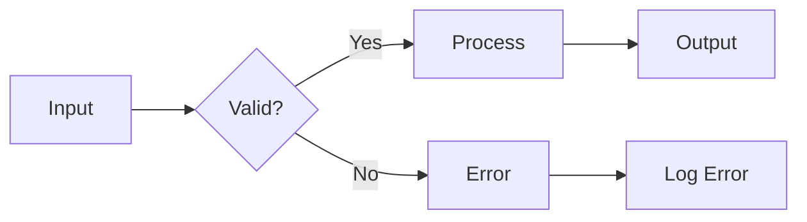

### Image with Description

Here's an example workflow:

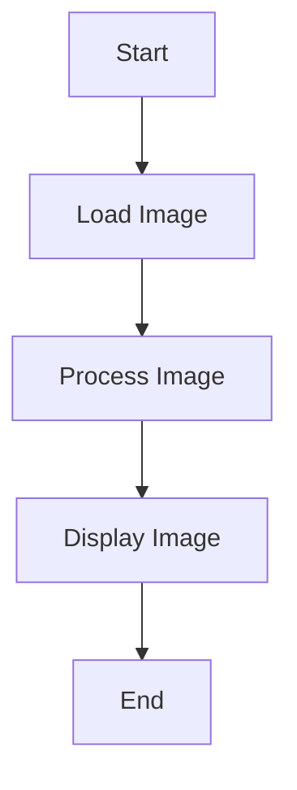

And here's how to reference the image in Markdown:

```markdown

```

---

## Quick Reference

### Basic Syntax Cheat Sheet

| Element | Syntax | Example |
|---------|--------|---------|
| Heading | `# H1` to `###### H6` | `## Heading` |
| Bold | `**text**` | **bold** |
| Italic | `*text*` | *italic* |
| Code | `` `code` `` | `code` |
| Link | `[text](url)` | [link](url) |
| Image | `` |  |
| List | `- item` or `1. item` | • item |
| Blockquote | `> quote` | > quote |
| Table | `\| col \|` | Table |
| Horizontal Rule | `---` | --- |

### Image Path Reference

- **Source**: `myblog/_pic/image.jpg`
- **Reference**: `/pic/image.jpg` (no underscore)
- **Built site**: `_site/pic/image.jpg`

### Mermaid Quick Reference

- **Flowchart**: `graph TD` or `graph LR`
- **Sequence**: `sequenceDiagram`
- **Class**: `classDiagram`
- **State**: `stateDiagram-v2`
- **Gantt**: `gantt`
- **Pie**: `pie`
- **Git**: `gitgraph`
- **ER**: `erDiagram`
- **Journey**: `journey`

---

## Tips and Best Practices

1. **Use descriptive alt text** for images
2. **Keep Mermaid diagrams simple** for better readability
3. **Test your syntax** before publishing
4. **Use consistent formatting** throughout your posts
5. **Optimize images** before adding them to `_pic/`
6. **Preview diagrams** using [Mermaid Live Editor](https://mermaid.live/)


## Progress Bar

### Inline Progress Bar

- [ ] the target is ongoing 

### Multiple Progress Bars

- [ ] Task 1: 
- [ ] Task 2: 
- [ ] Task 3: 

### Progress Bar Syntax

**HTML syntax (works inline):**
```html
- [ ] Task 
```

**Progress bar URL format:**
```
https://progress-bar.xyz/[PERCENTAGE]/
```

**Examples:**
- `https://progress-bar.xyz/0/` - 0%
- `https://progress-bar.xyz/25/` - 25%
- `https://progress-bar.xyz/50/` - 50%
- `https://progress-bar.xyz/75/` - 75%
- `https://progress-bar.xyz/100/` - 100%

**Note**: Use HTML `` tag with `display: inline` style to keep progress bars on the same line. 

---

---

## Automatic Header Numbering

The header numbering feature automatically adds sequence numbers to markdown headers without modifying the markdown source.

### How It Works

Headers are automatically numbered when the feature is enabled. Notice the headers below - they will show numbers if numbering is enabled for this page.

### Example with Nested Numbering

This page demonstrates nested numbering (1.1.1 style). The numbers are added automatically by JavaScript.

#### First Subsection

This is a subsection under the main section.

##### Sub-subsection

Even deeper nesting works!

##### Another Sub-subsection

Another sub-subsection at the same level.

#### Second Subsection

Another subsection under the main section.

### How to Enable

#### Method 1: Enable for This Post

Add to the front matter:

```yaml
---
layout: post
title: "My Post"
header_numbering: true
header_numbering_style: nested
---
```

#### Method 2: Enable Site-Wide

Add to `_config.yml`:

```yaml
header_numbering: true
header_numbering_style: nested
```

#### Method 3: Disable for Specific Post

```yaml
---
header_numbering: false
---
```

### Numbering Styles

- **Nested** (default): `1`, `1.1`, `1.1.1`, `1.2`, `2`, `2.1`, etc.
- **Flat**: Only numbers H1 headers (`1`, `2`, `3`, etc.)

### Configuration Options

**Per-page options:**
- `header_numbering: true/false` - Enable/disable for this post
- `header_numbering_style: nested/flat` - Choose numbering style

**Site-wide options** (in `_config.yml`):
- `header_numbering: true/false` - Enable/disable globally
- `header_numbering_style: nested/flat` - Default style

### Notes

- Numbers are added automatically - no need to modify markdown
- Page-level settings override site-wide settings
- Numbers are styled with CSS and can be customized
- Works with all header levels (H1-H6)

---

## Hiding Blog Posts

You can hide blog posts from appearing in listings (like the index page) while keeping them accessible via direct URL.

### Method 1: Hide Individual Post

Add `published: false` to the post's front matter:

```yaml
---
layout: post
title: "My Draft Post"
date: 2025-11-14
published: false
---
```

**Note:** The post will still be accessible via direct URL, but won't appear in `site.posts` collections or listings.

### Method 2: Hide Posts Site-Wide

Add posts to the `exclude` list in `_config.yml`:

```yaml
exclude:
  - _posts/2025-11-14-draft-post.md
  - _posts/drafts/
```

**Note:** Excluded posts won't be processed by Jekyll at all and won't be accessible via URL.

### Tips

- Use `published: false` for drafts you want to keep accessible but hidden from listings
- Use `exclude` in `_config.yml` for posts you don't want processed at all
- You can exclude entire directories (e.g., `_posts/drafts/`) or specific files
- Excluded files won't appear in any collections or be built by Jekyll

---
## Summary

This demo page showcases:

✅ **Basic Markdown**: Headings, text formatting, lists, links, code, tables  
✅ **Images**: From `_pic/` directory with various display options  
✅ **Mermaid Diagrams**: Flowcharts, sequence diagrams, class diagrams, and more  
✅ **Progress Bars**: Inline progress indicators  
✅ **Header Numbering**: Automatic sequence numbering for headers  

Use this page as a reference when writing your blog posts!